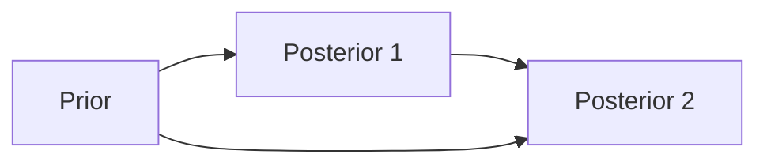

---
{"publish":true,"title":"Bayes Estimation","created":"2022-12-07T14:43:47","modified":"2025-06-27T22:23:20","cssclasses":"","aliases":null,"type":"note","sup":["[[Probability Theory]]","[[Statistics]]"],"state":"done"}
---

# Bayes Estimation

This is often the case: to estimate a parameter, we have some *prior* knowledge about the parameter.
When the prior knowledge is expressible in terms of a probability distribution, we call it the **prior distribution**.
Before observing the data, we think $\theta$ follows the prior distribution.

Then after observing some data, we update the distribution of $\theta$ as the **conditional distribution**, called the **posterior distribution**.
If the distribution is continuous, we have the posterior [[Probability Density Function\|PDF]]
$$
f(\theta| x_{1},\dots,x_n) = \frac{f(x_{1},\dots,x_n|\theta)p(\theta)}{\int f(x_{1},\dots,x_n|\theta)p(\theta) \, dx },
$$
where $p$ is the prior density function, and here we use the [[Bayes' theorem]].

We can directly return this posterior distribution as a distribution estimator of $\theta$, or derive various estimators from it, such as [[Maximum a Posteriori\|MAP]], high-probability region, and [[Bayes Optimal Estimator]], which is often shorten as *the* Bayes estimator.

## Sequential Update

Sometimes we have sequential trials/observations, giving the following commutative graph:

This graph holds because of the important property of Bayesian inference: the update can be done equivalently either by incorporating the data "all at once", or by incorporating the data sequentially with each posterior forming the prior for the next recursive update.

### Conjugate Prior

Calculating sequential posteriors is often the most challenging part of Bayesian inference. A property that would help is that if the prior distribution is in family $F$, the posterior distribution is also in $F$.
Such distributions are called the ==conjugate prior==.
Some examples are

- [[Beta Distribution]] is the conjugate prior of [[Binomial Distribution]]: $\operatorname{Beta}(a,b)\overset{ p }{ \to }\operatorname{Binom}(n,p) = \operatorname{Beta}(a+x,b+n-x)$
- [[Gamma Distribution]] is the conjugate prior of [[Poisson Distribution]]: $\operatorname{Gamma}(\alpha,\beta)\overset{ \lambda }{ \to }\operatorname{Poisson}(\lambda) = \operatorname{Gamma}(\alpha+n,\beta+\sum x _i)$
- [[Normal Distribution]] is the conjugate prior of [[Normal Distribution]]: $\operatorname{Normal}(\mu_{0},\tau ^{2})\overset{ x }{ \to }\operatorname{Normal}(\mu,\sigma^{2}) = \operatorname{Normal}((1-B)\overline{X}+B \mu_{0},(1-B)\sigma^{2} /n)$, where $B = \frac{\sigma^{2} /n}{\sigma^{2} /n+\tau^{2}}$.
- Inverse Gamma distribution is the conjugate prior for the variance of a univariate [[Normal Distribution]] with unknown mean and variance
- Inverse Wishart distribution is the conjugate prior for the covariance matrix of multi-variate [[Normal Distribution]] with unknown mean and covariance matrix
