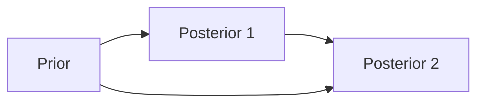
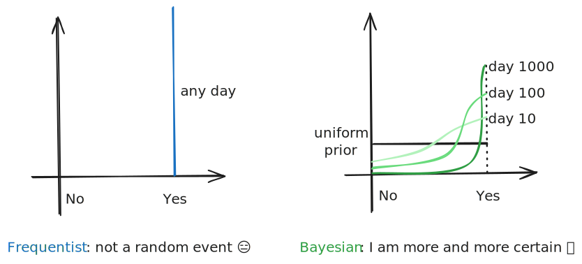

---
{"publish":true,"aliases":["Bayesian Statistics"],"created":"2022-05-28T03:34:22","modified":"2025-07-30T03:13:02","cssclasses":"","type":"note","sup":["[[Statistics]]"],"state":"done"}
---

# Bayesian Statistics

In ==frequentist== statistics, the best [[Statistical Decision Theory\|decision]] is unique and thus has a single value.
For example, in [[Regression]], the data is assumed to be generated corresponding to a fixed parameter, and we aim to recover this parameter, using methods such as [[Maximum Likelihood Estimation]], and then make [[Prediction]]s based on that point estimate of the parameter.
An alternative approach is to consider **all possible values** of the parameter when making a decision. This is the perspective of ==Bayesian== statistics: the true model is not treated as fixed but as unknown and uncertain, and is represented by a **random variable**.

A fundamental strength of Bayesian statistics, especially important in practical applications, is its ability to incorporate **prior knowledge**.
Before observing the data, we express our knowledge about the model through a ==prior probability distribution== of the model.
The prior distribution can be nearly deterministic (low variance, low entropy, highly informative), reflecting a strong prior belief about the model, or it can be nearly uniform (high variance, high entropy, less informative), reflecting limited prior knowledge.

This probability distribution over the model or its parameter is referred to as our ==belief==, and our [[Statistical Decision Theory\|statistical decision-making]] should be based on this belief.
Once the data is observed, we should update our belief to incorporate the new information.
This is done by updating the prior distribution using [[Bayes' theorem]] conditioned on the observed data, resulting in the ==posterior distribution==.

Bayesian statistics is primarily concerned with inferring the underlying model (==Bayesian estimation==), from which we can make further decisions (Bayesian inference).

## Calculating Posterior

For simplicity and without loss of rigor, we use a unified notation $p(\cdot)$ to denote any distribution (PDF or PMF), and the specific distribution should be clear from its argument. $p(y\given z)$ is the [[Conditional Probability\|conditional distribution]] of $y$ given $z$.
Therefore, consider a parameter space $\Theta$ and sample $X = (X_{1},\dots,X_{n})$, our prior is $p(\theta)$, the [[Likelihood]] is $p(x\given \theta)$, and the posterior is $p(\theta\given x)$.

By the [[Bayes' theorem]], the posterior is given by
$$
p(\theta\given X) = \frac{p(X\given\theta)p(\theta)}{\int _{\Theta} p(X\given\theta)p(\theta) \, \d \theta } \propto p(X\given\theta)p(\theta).
$$
The posterior density at $\theta$ is proportional to $p(X\given \theta)p(\theta)$ as the denominator is a constant with respect to $\theta$.

### Sequential Update

Sometimes we have sequential trials/observations, giving the following commutative graph:

This graph holds because of the important property of Bayesian inference: the update can be done equivalently either by incorporating the data "all at once", or by incorporating the data sequentially with each posterior forming the prior for the next recursive update.

### Conjugate Prior

Calculating sequential posteriors is often the most challenging part of Bayesian inference. A property that would help is that if the prior distribution is in family $F$, the posterior distribution is also in $F$.
Such distributions are called the ==conjugate prior==.
In the following list of example conjugate priors, we write $\text{prior dist.} \overset{ \text{model param.} }{ \to } \text{data-gen. dist.} = \text{post. dist.}$.

* [[Beta Distribution]] is the conjugate prior of [[Binomial Distribution]]: $\operatorname{Beta}(a,b)\overset{ p }{ \to }\operatorname{Binom}(n,p) = \operatorname{Beta}(a+x,b+n-x)$
* [[Gamma Distribution]] is the conjugate prior of [[Poisson Distribution]]: $\operatorname{Gamma}(\alpha,\beta)\overset{ \lambda }{ \to }\operatorname{Poisson}(\lambda) = \operatorname{Gamma}(\alpha+n,\beta+\sum x _i)$
* [[Normal Distribution]] is the conjugate prior of [[Normal Distribution]]: $\operatorname{Normal}(\mu_{0},\tau ^{2})\overset{ x }{ \to }\operatorname{Normal}(\mu,\sigma^{2}) = \operatorname{Normal}((1-B)\overline{X}+B \mu_{0},(1-B)\sigma^{2} /n)$, where $B = \frac{\sigma^{2} /n}{\sigma^{2} /n+\tau^{2}}$.
* Inverse Gamma distribution is the conjugate prior for the variance of a univariate [[Normal Distribution]] with unknown mean and variance
* Inverse Wishart distribution is the conjugate prior for the covariance matrix of multi-variate [[Normal Distribution]] with unknown mean and covariance matrix

## Choosing Prior

### Non-informative and Improper Prior

When we do not have any prior knowledge or assumption about the model, we can use the non-informative prior: [[Uniform Distribution]], which is the distribution that has the highest entropy and thus the least information.

Sometimes $\Theta$ may not possess a [[Sigma Field]] that allows us to define a uniform distribution, for example, when $\Theta$ is unbounded or countably infinite. The principle still holds that we want the prior to assign equal *measure* to all elements in $\Theta$.
This leads us to consider general [[Measure]]s as priors. Luckily, the [[Bayes' theorem]] and the calculation in [[Bayesian Inference#Calculating Posterior]] still hold.

* [@] The [[Borel Sigma Field\|Lebesgue Measure]] and counting measure are the *uniform* measure on a [[Borel Sigma Field\|Borel Set]] and a countable set, respectively.
* [!] $\operatorname{Unif}[0,1] = \operatorname{Beta}(1,1)$ and $\operatorname{Unif}(-\infty,\infty)=\mathcal{N}(0,\infty)$.

When the prior measure is not integrable, i.e., $\int _{\Theta}p(\theta)\d \theta = \infty$, we call it an ==improper prior==.

* [*] Importantly, non-informative priors reduce the Bayesian statistics to frequentist statistics.

### Jeffreys Prior

The Jeffreys prior,
$$
p(\theta) \propto \sqrt{ \det I(\theta) },
$$
where $I(\theta)$ is the [[Fisher Information]] matrix, enjoys the **reparametrization invariance principle**: if $\eta = \phi(\theta)$ is a reparametrization of $\theta$, then the distribution of $\eta$ satisfies
$$
p(\eta) \propto \sqrt{ \det \tilde{I}(\eta) },
$$
where $\tilde{I}(\eta)$ is the Fisher information matrix of the statistical model parametrized by $\eta$ instead of $\theta$.

## Bayesian Estimation

Now back to the task of [[Estimation\|estimating]] the parameter $\theta$.
First, we note that the posterior $\theta \given X$ itself is a ==distribution estimator== of $\theta$.
We can also derive set estimators and point estimators, similar to those in frequentist statistics, from the posterior distribution.

For point estimators, we have

* [[Maximum a Posteriori]], which returns the **mode** of the posterior distribution.
* [[Bayes Optimal Estimator]], which returns the
    * **mean** of the posterior distribution for [[Mean Squared Error]], or any [[Bowl-Shaped Loss]] with a Gaussian posterior;
    * **median** of the posterior distribution for absolute error loss $L(\hat{\theta},\theta)= |\hat{\theta}-\theta|$;
    * **mode** of the posterior distribution for zero-one loss $L(\hat{\theta},\theta)= \mathbb{I}(\hat{\theta}\ne\theta)$.

^bayes-est-comp

For set estimators, we have Bayesian confidence regions. A Bayesian confidence region $C \subset \Theta$ if of level $1-\alpha$ if
$$
P(\theta\in C \given X) \ge 1-\alpha.
$$
We remark that Bayesian confidence regions depend on the prior. If the prior is highly deterministic, the Bayesian confidence region will largely be determined by the prior, with small influence from the data.

## Bayesian vs Frequentist

* Frequentists believe in empirical data and use probability distributions to *model* the observed data.
* Bayesians believe there is an underlying distribution, and use samples to *infer* that distribution.

Take the [sunrise problem](https://en.wikipedia.org/wiki/Sunrise_problem): "Will the sun rise tomorrow?"
A frequentist would say it definitely will, as it always has—there’s no empirical evidence (e.g., the sun ever failing to rise) that justifies treating it as a random event. Even if they model it as a random experiment, say a Bernoulli trial, the repeated success would lead them to conclude the sun will rise tomorrow with probability one.
A Bayesian with no prior knowledge would update their belief as they observe the sun rise day after day, assigning an increasingly high probability to it happening again tomorrow, but never quite reaching certainty until the end of time.

Frequentist and Bayesian perspectives can be unified through the lens of [[Optimization]]: a frequentist seeks the parameter that [[Empirical Risk Minimization\|minimizes the empirical risk]], while a Bayesian seeks a posterior distribution that minimizes an energy functional using a variational formulation. With more samples, both follow gradient descent type dynamics toward the minimizer, with the convergence rate captured by a [[Poincare Inequality\|Poincaré type inequality]].
