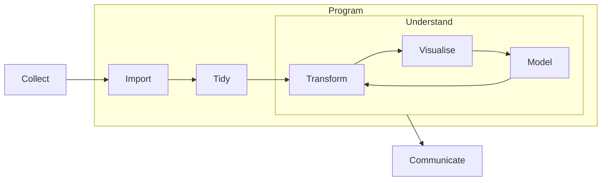

# EDAV

<input type="checkbox" id="logo" checked>
<label for="logo">
    

        

    

</label>
<blockquote> "Visualization is a fundamentally human activity."
</blockquote>

> [!garden] This site is a [**digital garden**](https://github.com/MaggieAppleton/digital-gardeners)[^1] for [**E**xploratory **D**ata **A**nalysis and **V**isualization](https://edav.info)
>
> - made by [me](https://me.zcysxy.space)
> - on materials from GR5702 Exploratory Data Analysis and Visualization course with [Joyce Robbins](https://github.com/jtr13) at Columbia University
> - with [Obsidian](https://obsidian.md) and [Obsidian Digital Garden](https://github.com/oleeskild/obsidian-digital-garden/tree/2.17.0)
> - source code: [zcysxy/edav-garden](https://github.com/zcysxy/edav-garden)
> - Interested in the logos/favicon? Get them [here](https://www.figma.com/community/file/1174213011958814978)

[^1]: In plain English: A collection of _notes_.

> [!success] Promotion
> Are you interested in the relationship between the reviews and streams of music? Please have a look at our EDAV project: [Review vs. Stream](https://edav-42.github.io/review-vs-stream).

## What is EDAV

- **Exploratory data analysis and visualization (EDAV)** is an **interdisciplinary** field combining
  - [[Statistics]]
  - [[Computer Science]]
  - Graphic Design
  - Journalism
  - Subject Expertise
  - Psychology
- The **task** of EDAV is to
  - Look for patterns
  - Identify outliers
  - Make comparisons
  - Discover clusters
- The fundamental **problem** of EDAV is
  - Exploration vs. Visualization
  - or, Exploratory vs. Explanatory
  - Explorations reveal information hidden in the data, which is deep and precise but can be convoluted
  - Visualizations offer insight into the data, which can be easily shared but may be misleading and biased
  - These two aspects are not mutually exclusive

## Plots Gallery

- [[EDAV - Continuous Variable|Continuous Variable]]
  - [[Histogram]]
  - [[Boxplot]]
  - [[Q-Q Plot]]
  - [[Density Curve]]
  - [[Ridgeline]]
- [[EDAV - Categorical Data|Categorical Data]]
  - [[Bar Chart]]
  - [[Cleveland Dot Plot]]
- [[EDAV - Dependency Relationship|Dependency Relationship]]
  - [[Scatterplot]]
  - [[Heatmap]]
  - [[Density Contour Plot]]
- [[EDAV - Multivariate Continuous Data|Multivariate Continuous Data]]
  - [[Scatterplot Matrix]]
  - [[Parallel Coordinate]]
  - [[Biplot]]
- [[EDAV - Multivariate Categorical Data|Multivariate Categorical Data]]
  - [[Mosaic Plot]]
  - [[Heatmap]]
  - [[Alluvial Diagram]]
- [[EDAV - Time Series|Time Series]]
- [[Spatial Data]]
  - [[Choropleth]]
  - [[Geographic Coordinate]]
- [[EDAV - Missing Data|Missing Data]]
- Other
  - [[Graph Color]]

## R Garden

- [[R]]
  ![[R#References]]

## Git Garden

- [[Git]]
- [[Git Commands]]
- [[Git Tagging]]

## WebDev Garden

- Basics
  - [[DOM]]
  - [[Developer Tools]]
- [[HTML]]
- [[CSS]]
- [[JavaScript]]
  - [[JS Function]]
    - [[JS Arrow Function]]
    - [[JS Function - map]]
  - ⭐️ [[D3]]
    - [[D3 Bind Data]]
    - [[D3 Scale]]
    - [[D3 Margin]]
    - [[D3 Axes]]
    - [[D3 Functions]]
    - [[D3 Interactivity]]
    - [[D3 Transition]]

## References

- For [[EDAV#Plots Gallery|Plots Gallery]]:
  - Robbins, Joyce. _<https://edav.info>_. 2022.
  - Unwin, Antony. _Graphical data analysis with R_. Chapman and Hall/CRC, 2018.
- For [[EDAV#R Garden|R Garden]]:
  - Wickham, Hadley, and Garrett Grolemund. _[R for data science: import, tidy, transform, visualize, and model data](https://r4ds.had.co.nz)_. O'Reilly Media, Inc., 2017.
- For [[EDAV#Git Garden|Git Garden]]:
  - Chacon, Scott, and Ben Straub. _[Pro Git](https://git-scm.com/book/en/v2)_. Springer Nature, 2014.
- For [[EDAV#WebDev Garden|WebDev Garden]]
  - Robbins, Joyce. _[D3 for R Users](https://jtr13.github.io/d3book/)_. 2022.
