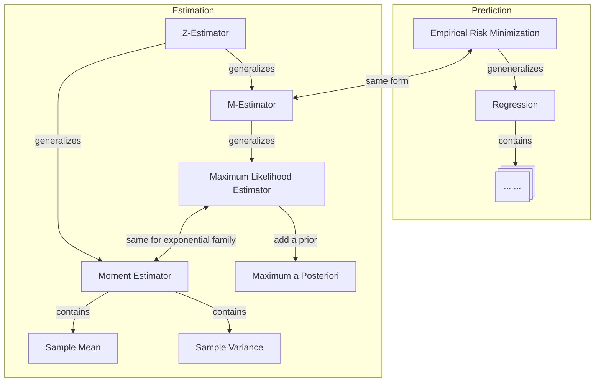

---
{"publish":true,"created":"2023-08-02T18:42:38","modified":"2025-06-27T21:47:22","cssclasses":"","type":"index","sup":["[[Machine Learning]]","[[Statistics]]"],"state":"done"}
---

# Estimation

- Types of estimation
    - [[Estimation#Point Estimation]]
    - [[Confidence Interval]]/Region
    - [[Bayes Estimator]]
- Metric
    - [[Evaluating an Estimator]]
    - [[Bayes Optimality]]
    - [[Minimax]]
- Methods
    - [[Method of Moments]]
    - [[Maximum Likelihood Estimation]]
    - [[Mean Squared Error\|Least Squares]]
    - [[M-Estimator]]
    - [[Z-Estimator]]

## Point Estimation

A ==point estimator/statistic== *recovers* a quantity of interest from data samples. Formally, it's any algorithm/measurable function that returns a **point** in the parameter space given the sample:
$$
\hat{\theta} : \mathcal{X}\to \Theta, \quad X \mapsto \hat{\theta}_{X}.
$$
The parameter space $\Theta$ can be one-dimensional, multi-dimensional, or even a function space. When the sample $X=(X_{1},\dots,X_{n})$ has a sample size/dimension of $n$, we also conventionally write $\hat{\theta}_{n}$ to denote the point estimator.

In contrast to point estimation, [[Confidence Interval]]/region returns a subset of the parameter space $\hat{C}\in 2^{\Theta}$, and [[Bayes Estimator]] returns a distribution over the parameter space $\hat{P}\in \Delta(\Theta)$.

## Comparison of Estimation Methods  

### MLE vs MoM

- For quadratic risks, [[Maximum Likelihood Estimation\|MLE]] is more accurate in general
- [[Maximum Likelihood Estimation#Misspecification\|MLE]] still gives good results even for misspecified models, while [[Method of Moments]] is more sensitive to model misspecification.
- Sometimes [[Maximum Likelihood Estimation\|MLE]] can be computationally intractable, and [[Method of Moments]] is easier with only polynomial equations.

### Bayesian Estimation

- Point [[Bayes Estimator]] returns the **mean** of the posterior distribution for any [[Bowl-Shaped Loss]].
- [[Maximum a Posteriori\|MAP]] returns the **mode** of the posterior distribution.
