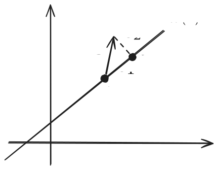

---
{"publish":true,"title":"Gaussian Linear Model","created":"2025-07-26T02:29:39","modified":"2025-07-27T00:26:11","cssclasses":"","state":"done","sup":["[[Linear Regression]]"],"aliases":null,"type":"note","related":["[[Estimation]]"]}
---

# Gaussian Linear Model

A Gaussian linear model is a [[Linear Regression\|linear model]] with [[Normal Distribution\|Gaussian]] noise:
$$
Y_{i} = X_{i}^T\theta + \epsilon _{i}, \quad \epsilon _{i} \overset{ \text{iid} }{ \sim } N(0, \sigma^2).
$$
Suppose we have a sample size $n$, $X_{i}\in\R^{d}$, $\theta\in\R^{d}$, $Y_{i}\in\R$. This note focuses on the regression task with a fixed design matrix $X = (X_{1},\dots,X_{n})^T\in\R^{n\times d}$, which reduces to the [[Estimation]] of $\theta$.

## Least Squares and Maximum Likelihood Estimation

[[Linear Regression#Ordinary Least Squares]] gives the [[Maximum Likelihood Estimation]] of $\theta$:
$$
\hat{\theta}^{(\mathrm{MLE})}=\hat{\theta}^{(\mathrm{LS})} = (X^TX)^{-1}X^TY .
$$
We can show that
$$
\hat{\theta}^{(\mathrm{LS})} \sim \mathcal{N}(\theta, \sigma^{2}(X^TX)^{-1}I_n).
$$
See [[Linear Regression#A Probabilistic View Maximum Likelihood Estimation]] for the derivation.

## Bayes Estimator

For prior $Q \sim \mathcal{N}(0,\tau^{2} I_{d})$ and a [[Bowl-Shaped Loss]] $L(a,\theta)=\ell(a-\theta)$, the [[Bayes Optimal Estimator]] is
$$
\hat{\theta}^{(\mathrm{Bayes})} = \left( X^TX + \frac{\sigma^{2}}{\tau^{2}}I \right) ^{-1} X^TY.
$$

### 1st Proof

We note that this is essentially [[Bayesian Linear Regression]].
Specifically, the posterior is also a Gaussian ([[Bayesian Inference#Conjugate Prior]]) that satisfies
$$
\begin{aligned}
p(\theta|Y) &\propto p(\theta, Y) \propto \exp\left(-\frac{1}{2}((Y - X\theta)^T \sigma^{-2} (Y - X\theta) + \theta^T \tau^{-2} \theta)\right) \\ 
&\propto \exp\left(-\frac{1}{2}(\theta - \hat{\theta}_{\mathrm{post}})^T \hat{\Sigma}_{\mathrm{post}}^{-1} (\theta - \hat{\theta}_{\mathrm{post}})\right) \\ 
&\sim \mathcal{N}(\hat{\theta}_{\mathrm{post}}, \hat{\Sigma}_{\mathrm{post}}) 
\end{aligned}
$$
where $\hat{\theta}_{\mathrm{post}} = (X^T X + \frac{\sigma^2}{\tau^2} I)^{-1} X^T Y$, $\hat{\Sigma}_{\mathrm{post}} = (\sigma^{-2} X^T X + \tau^{-2} I)^{-1}$

By [[Anderson's Lemma]], $\hat{\theta}^{(\mathrm{Bayes})} = \hat{\theta}_{\mathrm{post}} = (X^T X + \frac{\sigma^2}{\tau^2} I)^{-1} X^T Y$,
Moreover, the Bayes risk is $R_{B}^{*}(\Theta) = \mathbb{E}[\ell(X_{\mathrm{post}}^{1 /2} W)]$ where $W \sim \mathcal{N}(0, I)$.

### 2nd Proof

Similarly, by [[Anderson's Lemma]], we know that $\hat{\theta}^{(\mathrm{Bayes})}$ is the posterior mean. Since for normal distribution, mean and mode coincide, we have
$$
\begin{aligned}
\hat{\theta}_{\mathrm{post}}^{\mathrm{mean}} = \hat{\theta}_{\mathrm{post}}^{\mathrm{mode}} &= \arg\max_{\theta} \exp\left(-\frac{1}{2}((Y - X\theta)^T \sigma^{-2} (Y - X\theta) + \theta^T \tau^{-2} \theta)\right) \\
&= \arg\min_{\theta} (\sigma^{-2} ||Y - X\theta||^2 + \tau^{-2} ||\theta||^2) \\ 
&= \arg\min_{\theta} (||Y - X\theta||^2 + \frac{\sigma^2}{\tau^2} ||\theta||^2).
\end{aligned}
$$
This corresponds to a [[Ridge Regression]], whose solution is
$$
\hat{\theta}^{(\mathrm{Bayes})} = \hat{\theta}_{\mathrm{post}}^{\mathrm{mean}}= \hat{\theta}_{\mathrm{post}}^{\mathrm{mode}}= \hat{\theta}^{(\mathrm{ridge})} = \left( X^T X + \frac{\sigma^2}{\tau^2} I \right)^{-1} X^T Y.
$$

## Minimax Estimator

For a [[Bowl-Shaped Loss]] $L(a,\theta)=\ell(a-\theta)$ and a full column rank design matrix $X\in\R^{n\times d}$, [[Linear Regression#Ordinary Least Squares]] also gives the [[Minimax Optimal Estimator]] of $\theta$:
$$
\hat{\theta}^{(\mathrm{Minimax})} = \hat{\theta}^{(\mathrm{LS})}.
$$

### Proof

Recall that $\hat{\theta}^{(\mathrm{LS})} \sim \mathcal{N}(\theta,(X^TX)^{-1}\sigma^{2})$. Thus, the risk is
$$
R(\lsq) = \mathbb{E}[\ell((\xx / \sigma^{2})^{-1}W)], \quad W \sim \mathcal{N}(0,I_{d}).
$$

**Case I. $d=n$ and $X=I$**.
Note that the risk of the least squares estimator is independent of $\theta$, and thus to show it's minimax optimal, we aim to find a prior $Q$ whose Bayes risk matches $R_{M}(\lsq)=R(\lsq)$ (see [[Minimax Optimal Estimator#Minimax via Bayes]]).
Recall (see [[Gaussian Linear Model#Bayes Estimator]]) that given a normal prior $Q_{\tau}=\mathcal{N}(0,\tau^{2}I_{d})$, the posterior is $\mathcal{N}\bigl( \hat{\theta}_{\mathrm{post}}, \bigl( \tfrac{\xx}{\sigma^{2}} + \tfrac{I}{\tau^{2}} \bigr)^{-1} \bigr)$, and the Bayes risk w.r.t $Q_{\tau}$ is
$$
R_{B}^{*}(Q_{\tau }) = \mathbb{E}\left[ \ell \left(  \left( \frac{\xx}{\sigma^{2}} + \frac{I}{\tau^{2}} \right)^{-1 /2}W  \right)  \right] 
= \mathbb{E}\left[ \ell \left(  \left( {\sigma^{-2}} + {\tau^{-2}} \right)^{-1 /2}W  \right)  \right] 
$$
Since $\ell$ is convex hence continuous, by the continuous mapping theorem,
$$
\begin{aligned}
\lim_{ \tau \to \infty } R^{*}_{B}(Q_{\tau}) =& \mathbb{E}\left[ \lim_{ \tau \to \infty } \ell ((\sigma^{-2}+\tau ^{-2})^{-1 /2} W) \right] \\
=& \mathbb{E}\left[ \ell (\lim_{ \tau \to \infty } (\sigma^{-2}+\tau ^{-2})^{-1 /2} W) \right] \\
=& \mathbb{E}\left[ \ell ( (\sigma^{-2})^{-1/2} W) \right] \\
=& \mathbb{E}\left[ \ell \left(  \left( \frac{\xx}{\sigma^{2}} \right)^{-1/2} W \right) \right] \\
=& R(\lsq).
\end{aligned}
$$

**Case II. $d=n$ and $X\ne I$**.
We define a new loss function by $\tilde{\ell}(a) = \ell(X^{-1}a)$. One can check that $\tilde{\ell}$ is also bowl-shaped. For a fixed design matrix $X$, we consider a general estimator $\hat{\theta}(Y)$ determined by $Y$. We have the equivalence:
$$
\begin{aligned}
R(\hat{\theta}(Y)) =& \mathbb{E}_{Y}\ell(\hat{\theta}(Y) - \theta)\\
=& \mathbb{E}_{Y} \tilde{\ell}(X\hat{\theta}(Y) - X\theta) \\
=& \mathbb{E}_{Y} \tilde{\ell}(X\hat{\theta}(X\theta + \epsilon) - X\theta) \\
=& \mathbb{E}_{Y} \tilde{\ell}(\hat{\eta}(S) - \eta),
\end{aligned}
$$
where the last equation applies the notation change:
$$
\eta = X\theta, \quad S = I \eta + \epsilon, \quad \hat{\eta} = X \hat{\theta}.
$$
In words, $\hat{\eta}$ is an estimator of the new parameter $\eta$ based on data $S$. One can see that
$$
\hat{\eta}^{(\mathrm{LS})} = S = Y = X^{-T} X^T X(\xx)^{-1} X^TY = X \lsq.
$$
We denote $\tilde{R}$ the risk of an estimator of $\eta$ w.r.t the new loss $\tilde{\ell}$.
Then, applying Case I to $\hat{\eta}^{(\mathrm{LS})}$ gives
$$
\tilde{R}(\hat{\eta}^{(\mathrm{LS})}) = \tilde{R}_{M} (\hat{\eta}^{(\mathrm{LS})})\le \tilde{R}_{M}(X\hat{\theta}) = \sup_{\eta} R(X\hat{\theta}, \eta),
$$
where $\hat{\theta}$ is a general estimator of $\theta$. Since $X$ is invertible, we have
$$
\sup_{\eta} \tilde{R}(X\hat{\theta},\eta) = \sup_{\theta} \tilde{R}(X\hat{\theta},X\theta) = \sup_{\theta}R(\hat{\theta},\theta) = R_{M}(\hat{\theta}).
$$
On the other hand, we have
$$
\tilde{R}(\hat{\eta}^{(\mathrm{LS})}) = \mathbb{E} \tilde{\ell}(\sigma W) = \mathbb{E}\ell(\sigma X ^{-1} W) = \mathbb{E}\left[\ell\left( \left( \frac{\xx}{\sigma^{2}} \right)^{-1 /2} W  \right)\right],
$$
where the last inequality uses the fact that $\sigma^{-1}X ^{-1} W \sim \mathcal{N}(0,(\xx)^{-1} \sigma^{2})$.
Combining the above three inequalities gives
$$
R(\lsq) = \tilde{R}(\hat{\eta}^{(\mathrm{LS})}) \le R_{M}(\hat{\theta}), \quad \forall \hat{\theta}.
$$
Thus, $\lsq$ is minimax optimal.

**Case III. $d < n$**. Let $U = X(\xx)^{-1 /2}$. Then $UU^T = X(\xx)^{-1}X^T$ is the orthogonal projection onto the column space of $X$. Then, we have
$$
U^TY \sim \mathcal{N}((\xx)^{1 /2}\theta, \sigma^{2} U^TU ) = \mathcal{N}((\xx)^{1 /2}\theta, \sigma^{2} I_{d}).
$$
Equivalently, the original data gives a new Gaussian linear model:
$$
U^TY = (\xx )^{1 /2}\theta + \epsilon', \quad \epsilon' \sim \mathcal{N}(0,\sigma^{2}I_{d}).
$$
This Gaussian linear model reduces to Case II. Specifically, with a fixed design matrix $(\xx)^{1 /2}$, let $A: U^TY\mapsto \hat{\theta}$ be a general estimator of $\theta$. And we denote $R_{d}$ the risk w.r.t this new Gaussian linear model. Then, Case II gives
$$
\sup_{\theta} R_{d}(A,\theta) \ge \mathbb{E}\left[ \ell\left( \left( \frac{( (\xx)^{1 /2} )^T(\xx)^{1 /2}  }{\sigma^{2}} \right)^{-1 /2}W  \right)  \right] 
= \mathbb{E}\left[ \ell\left( \left( \frac{ \xx  }{\sigma^{2}} \right)^{-1 /2}W  \right)  \right]  = R(\lsq).
$$
Therefore, we are left to show that for any general estimator $\hat{\theta}(Y)$ corresponding to the original Gaussian linear model, there exists a induced estimator $A(U^TY)$ such that $R_{d}(A,\theta) = R(\hat{\theta},\theta)$. We claim this is true with the following *randomized* induced estimator:
$$
A(T) = \hat{\theta}(Y), \quad Y \sim \cdot \given T,
$$
where $T = U^TY$.

The induced estimator works as follows: upon observing $T$, we simulate $Y$ from the conditional distribution $\cdot \given T$, and then apply the original estimator $\hat{\theta}(Y)$ to obtain $A(T)$.
In our case, since we actually observe $Y$, we directly have $A(T)=\hat{\theta}(Y)$. However, we can still interpret $Y$ as being generated from the conditional distribution $\cdot \given T$.

Suppose $T$ is a [[Sufficient Statistic]] of $Y$, the above claim is true:
$$
\begin{aligned}
R(\hat{\theta},\theta) =& \mathbb{E}_{Y \sim P_{\theta}} \ell(\hat{\theta}-\theta )\\
=& \mathbb{E}_{Y \sim \cdot \given T} \ell(\hat{\theta}-\theta )\\
=& \mathbb{E}_{T} [\mathbb{E}_{Y}[\ell(\hat{\theta}-\theta ) \given T]]\\
=& \mathbb{E}_{T} [\mathbb{E}_{Y}[\ell(A(T)-\theta ) \given T]]\\
=& \mathbb{E}\ell(A(T)-\theta ) \\
=& R_{d}(A,\theta).
\end{aligned}
$$
Therefore, we are left to show that $T$ is indeed a sufficient statistic of $Y$. We provide three methods.

#### Method I. Intuition

Let $P\coloneqq UU^T \in \operatorname{OrthBasis}(\operatorname{col}(X))$. Then,
$$
X\theta + \epsilon = \underbrace{X\theta + P\epsilon}_{\in \operatorname{col}(X)} + \underbrace{(I-P)\epsilon}_{\in \operatorname{col}(X)^\perp}
$$
Note that for a Gaussian vector, [[Gaussian Properties#Independence, Correlation, and Jointly Normal\|zero correlation implies independence]]. And since perpendicular vectors have zero correlation, we have $(I-P)\epsilon \Perp U^T Y = X\theta + P\epsilon$. Moreover, since $(I-P)\epsilon \Perp \theta$, we can simulate $Y = UU^T Y + (I-P)\epsilon$ without $\theta$. Thus $U^T Y$ is sufficient.

In words, $U^TY$ captures all the information of $\theta$ left-applied by $X$. The remaining part is pure noise perpendicular to the column space of $X$ and does not depend on $\theta$. This is illustrated in the following plot, where $\epsilon_{1} = P\epsilon$ and $\epsilon_{2} = (I-P)\epsilon$.

#### Method II. Fisher-Neyman Factorization

We first show that $X^T Y$ is sufficient:
$$
\begin{aligned}
Y \sim \mathcal{N}(X\theta, \sigma^2 I) \implies p(y) &= (2\pi\sigma^2)^{-\frac{n}{2}} \exp\left(-\frac{1}{2\sigma^2}(y-X\theta)^T(y-X\theta)\right) \\
&= \underbrace{(2\pi\sigma^2)^{-\frac{n}{2}} \exp\Bigl(-\frac{1}{2\sigma^2}(\theta^T X^T X\theta - 2\theta^T X^T y}_{g(T(y), \theta)} + y^T y)\Bigr)
\end{aligned}
$$
By [[Sufficient Statistic#Fisher-Neyman Factorization Theorem]], $X^T Y \in \mathbb{R}^d$ is sufficient
Since $X$ is full column-rank, $(X^T X)^{-1/2}$ exists and $(X^T X)^{-1/2}X^T Y$ is also sufficient.

#### Method III. Conditional Simulation

We first show that $Y \given UU^T Y \Perp \theta$.

Note that
$$
\begin{aligned}
UU^T Y &= X(X^TX)^{-1}X^T(X\theta+\epsilon) \\
&= X\theta + (UU^T \epsilon) \\
&= Y - (I - UU^T)\epsilon
\end{aligned}
$$
Therefore,
$$
Y \given UU^T Y=t \sim \mathcal{N}(t, (I-UU^T)\sigma^2(I-UU^T)^T).
$$
Finally,
$$
Y \given U^T Y=t \sim \mathcal{N}(Ut, (I-UU^T)\sigma^2 I)
$$
Thus, $U^T Y$ is sufficient.

