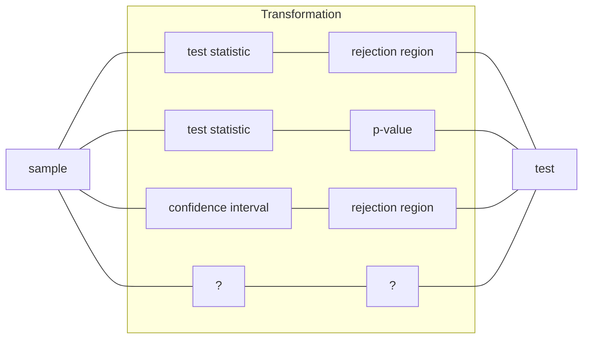

# Hypothesis Testing

> [!tldr]- Takeaway Card
>
> - Numerous concepts around hypothesis testing (HT) can be confusing. Always locate yourself in the general **[[Statistical Decision Theory|statistical binary decision-making]]** framework.
> - Under this framework, the question asked for the task is "[[#how to evaluate a test]]?" All different metrics stem from the two basic ones: Type I error and Type II error. See also the [[Evaluating a Test#^confusion|confusion matrix]] of an HT. Remember that your evaluation can always balance the two errors, or focus on one of them.
> - The question asked for the algorithm is "[[#how to construct a test]]?" This statistical procedure is simply a _transformation_ of the sample into a binary decision rule. One transformation path is through [[#test statistic and rejection region]]. Another path is through test statistic and [[p-value]].
> - HT focuses on _disproving_ the null hypothesis, resulting in an _asymmetry_ between the null and alternative hypotheses. Calculating the Type I error, test statistic (under the null), and p-value only requires the null hypothesis. However, the [[#Role of Alternative|alternative hypothesis plays a role]] in shaping the belief about the complement of the null and dictating the direction of extremeness.

Hypothesis testing (HT) is a classical [[Statistical Decision Theory|statistical decision-making]] problem, and can be extended to more general binary statistical decision-making problems. Given sample $X$, we need to make a decision $A(X)$ such that $A(X) \approx \mathbb{1}_{H_{1}}$, where $H\_{1}$ is the alternative hypothesis.
In the context of HT, the statistical procedure $A$ is often called a ==test==, and denoted as $\psi(X)$. A test is a [[Statistic]].

Formally, given a [[Statistical Model]] ${ P\_{\theta} }_{\theta\in\Theta }$, we want to test the following hypotheses:
$$
\begin{cases}
H_{0}: \theta \in \Theta _{0}, & \text{(null hypothesis)}\\
H_{1}: \theta \in \Theta\_{1}, & \text{(alternative hypothesis)}
\end{cases}
$$
where $\Theta\_{0}$ and $\Theta\_{1}$ are disjoint subsets of $\Theta$.

## Basic Concepts

- Asymmetry in $H\_{0}$ and $H\_{1}$: the data is only used to try to disprove $H\_{0}$. The result of an HT is either to **reject** or **fail to reject** the null hypothesis $H\_{0}$. ^d85be2
- If $\Theta\_{0} \cup \Theta\_{1} = \Theta$, then we say we test $H\_{0}$ against $H\_{1}$. In this case, rejecting $H\_{0}$ implies acceptance of $H\_{1}$.
- Failing to reject $H\_{0}$ never implies acceptance of $H\_{0}$, but only that we do not have enough evidence to reject it.
- When $\Theta\_{0}$ and $\Theta\_{1}$ are singletons, we call it a ==simple-simple== HT. Otherwise, we call it a ==composite== HT.
- Suppose $\Theta\_{0} = { \theta\_{0} }$ and $\theta\_{0}\in\R$. Then the HT is ==two-sided== if $H\_{1} : \theta\ne\theta\_{0}$, or is ==one-sided== if $H\_{1} : \theta < \theta\_{0}$ or $H\_{1} : \theta > \theta\_{0}$.

## How to Evaluate a Test

We now focus on the test, i.e., the statistical procedure/algorithm/policy $\psi$ for an HT. The first question is

- What is a good/optimal test?

Please refer to [[Evaluating a Test]] for some answers.

## How to Construct a Test

Once we determine the evaluation criteria for a test, the next question is

- How to construct a test $\psi$ that satisfies the criteria?

In this note, we focus on constructing tests that achieve a certain significance level $\alpha$.

Simple constructions directly map the sample to a decision rule, for example: after tossing a coin 4 times, we decide the coin is biased (towards heads) if the number of heads is greater than 2.

More sophisticated and principled methods are needed. In response, some transformations of the sample (statistics) are introduced to construct the test. We discuss two examples:

- [[#Test Statistic and Rejection Region]]. A test statistic is a statistic of the sample usually with a known distribution **under the null hypothesis**. Then the critical values form a rejection region for the test statistic. The test is then based on whether the test statistic falls into the rejection region.
- [[#p-value]]. Sometimes critical values are not available, or the rejection region is not easy to construct. The use of p-value eliminates the need for rejection regions. p-value is a statistic of the test statistic (which is a random variable). The test is then based on whether the p-value is smaller than the level $\alpha$.
  - If we treat p-value as the test statistic, we can see that it gives a principled way of constructing rejection regions: $\mathrm{RR} = { p \le \alpha }$, without the need for other critical values.

## Test Statistic and Rejection Region

For a hypothesis and sample ${ x\_{i} }$, we construct a ==rejection region== of the following form:
$$
\mathrm{RR} = { x\_{1},\dots,x\_n \mid t \ge c },
$$
where $t$ is called the ==test statistic==, and $c$ is called the ==critical value==.
If ${ x\_{i} } \in \mathrm{RR}$ , we **reject** the hypothesis.

See [[#CLT Test Statistic]] for an example of a test statistic.

### Rejection Region by Confidence Interval

There is a [[Confidence Interval and Hypothesis Test Duality|duality between confidence interval and hypothesis tests]].
Suppose we have a level $(1-\alpha)$ [[Confidence Interval]] for $\theta$ given by $\[l(\boldsymbol{x}), u(\boldsymbol{x})]$. Then the rule "reject $\mathrm{H}_0: \theta=\theta_{0}$ if $\theta\_0 \notin\[l(\boldsymbol{x}), u(\boldsymbol{x})]$" has a significance level $\alpha$:
$$
P\_{\theta\_{0}}(\psi(X)=1) = P\_{\theta\_{0}}\left( \[l(X),u(X)]\not\ni\theta\_{0}  \right) = \alpha.
$$
Therefore, a rejection region can be constructed by the complement of the confidence interval.
See [[Confidence Interval and Hypothesis Test Duality]] for constructing CIs from HTs.

### Rejection Region by Likelihood Ratio

![[Likelihood Ratio Test#Rejection Region|n-h]]

## CLT Test Statistic

Similar to [[Confidence Interval#CLT CI]], [[Central Limit Theorem|CLT]] is also often used to construct a test statistic, and then the [[#p-value]], especially for HTs about the mean.

- Recall that a test statistic, or the HT itself, is to disprove null. Thus, a test statistic is often constructed as a function of $\theta\_{0}$.

Suppose we want to test the null about mean $H\_{0}: \theta=\theta\_{0}$. Assuming null, CLT gives
$$
\frac{\theta- \theta\_{0}}{\operatorname{SE}(\theta )} \overset{d}{\longrightarrow} \mathcal{N}(0,1).
$$

- Different from the [[Confidence Interval#Wald CI|Plug-in CI]], we do not need to estimate the standard error using estimated $\theta$. Instead, we use the known $\theta\_{0}$ to calculate the standard error.

More concretely, suppose the sample is $n$ iid Bernoulli r.v.s. Then the test statistic is
$$
T\_n = \sqrt{ n } \frac{\overline{X} - \theta\_{0}}{\sqrt{ \theta\_{0}(1-\theta\_{0}) }}.
$$
And the rejection region for a $\alpha$-level test is
$$
\mathrm{RR} = \begin{cases}
T\_n \ge z\_{1-\alpha} && \text{ (right-tail test)},\\
T\_n \le z\_{\alpha} &&\text{ (left-tail test)},\\
|T\_n| \ge z\_{1- \alpha /2} &&\text{ (two-sided test)},
\end{cases}
$$
where $z\_{\beta}$ is the $\beta$-quantile of the standard normal distribution.

### Wald Test

In a more general parametric setting where we want to test some parameter $\theta$, we can construct an [[Estimation|estimator]] and its asymptotic distribution using the _estimated_ standard error:
$$
W\coloneqq \frac{\hat{\theta}_{X} - \theta _{0}}{\widehat{\mathrm{SE}}(\hat{\theta}_{X})} \to \mathcal{N}(0,1), \quad \text{under the null } H_{0}: \theta ^{\*} = \theta _{0}.
$$
The left-hand side $W$ is called the ==Wald test statistic==. The rejection region is then ${ |W| > z_{1-\alpha /2} }$ for a two-sided test, or ${ W \lessgtr z\_{1-\alpha} }$ for one-sided tests.

If the estimator if [[Maximum Likelihood Estimation|MLE]], under [[Regularity Conditions in Estimation#For Maximum Likelihood Estimation|sufficient regularity conditions]], the SE is $\sqrt{ (nI(\theta\_{0}))^{-1} }$. Similarly, the Wald test statistic is
$$
W = \sqrt{ n I(\hat{\theta}^{\mathrm{MLE}}_{X}) }\left( \hat{\theta}^{\mathrm{MLE}}_{X} - \theta \_{0} \right) .
$$

The use of estimated SE (variance) is also helpful for _non-parametric_ tests. For example, if we want to test if two independent samples $X$ and $Y$ have the same mean, the Wald test statistic is
$$
W = \frac{\overline{X} - \overline{Y}}{\widehat{\mathrm{SE}}(\overline{X}-\overline{Y})} = \frac{\overline{X} - \overline{Y}}{\sqrt{  \widehat{\Var}(\overline{X}) + \widehat{\Var}(\overline{Y})}} = \frac{\overline{X} - \overline{Y}}{\sqrt{ \frac{\hat{\sigma}^{2}_{X}}{n} + \frac{\hat{\sigma}_{Y}^{2}}{m} }},
$$
where $n$ and $m$ are the sample sizes of $X$ and $Y$, and we use sample means and sample variances as estimators.

## Non-Asymptotic Test Statistic

Unlike [[#CLT Test Statistic]], which relies on [[Central Limit Theorem|CLT]] and [[Convergence of Random Variables#Slutsky's Theorem|Slutsky's theorem]] for [[#Wald Test]] to calculate the critical values, a non-asymptotic test statistic is more suitable for small sample sizes. A test statistic is non-asymptotic if we know its (approximate) distribution under the null without relying on asymptotic properties.
If the underlying sample is already [[Normal Distribution|normal]], then example distributions for non-asymptotic test statistics include [[Chi-Square Distribution]] and [[t Distribution]].
Other parts of the test procedure are the same as those using other test statistics.

## p-Value

![[p-value#Introduction|naked n-h]]

## Role of Alternative

Recall that ![[#^d85be2|inline]]

Also notice that in the calculation of the test statistic, critical value, and p-value, we only need the null hypothesis $H\_{0}$. This brings up the question:

> [!qn] what is the role of the alternative hypothesis $H\_{1}$?

We first remark that we do not expect the alternative to have the same critical role as the null, due to the asymmetry. However, the alternative do have two important implications:

- The alternative shapes the belief about the complement of the null. Specifically, the set pair $(\Theta\_{0},\Theta\_{1})$ forms a _model assumption_, meaning that we believe the true parameter is either in $\Theta\_{0}$ or $\Theta\_{1}$. Under this belief, when rejecting $H\_{0}$, we implicitly accept $H\_{1}$.
  - For example, a company want to test their current risk control threshold $\theta\_{0}$. Their hypotheses are $H\_{0}: \theta = \theta\_{0}$ and $H\_{1}: \theta > \theta\_{0}$. We can see that, they only reject the null if they _believe the risk is higher_ then their current threshold. They do not modify the threshold (reject the null) even observing a risk significantly lower than the threshold, as it does no harm.
- The alternative dictates the direction of extremeness. When calculating the rejection region or p-value, it's important to know what counts as an _extreme_ event under the null. The alternative dictates the direction, i.e., right-tail, left-tail, or two-sided.
  - For example, suppose $H\_{0}: \text{mean} = \mu\_{0}$ and $H\_{1} : \text{mean} = \mu\_{1}$. Then, if $\mu\_{1} > \mu\_{0}$, it is extreme(ly unlikely the null is true) when we observe a large sample mean; on the other hand, if $\mu\_{1} < \mu\_{0}$, a small sample mean is extreme under the null.
