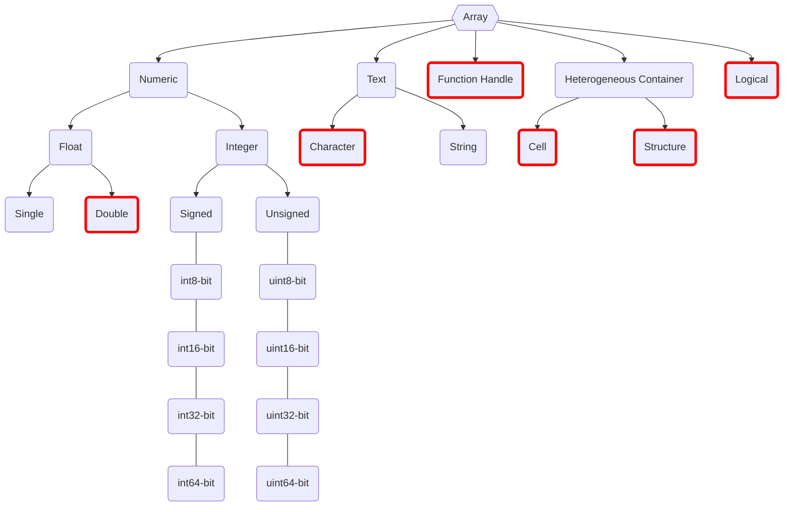

# Matlab Types

- MATLAB stores and accesses all data through the **[[Matlab Array|array]]** structure; "data type" refers to the type of the **elements** of an array
- MATLAB's data types are described as **classes with attributes**
  - For example, a complex number has class **double** with attribute **complex**
  - As with [[Python Sequence]] in [[Python]], you can index, slice, and so on
- There are \[15]"R2012b"+x built-in fundamental types and 2 user-defined kinds^\[<https://www.mathworks.com/help/matlab/matlab_prog/fundamental-matlab-classes.html>]
- Fundamental data types:
  - [[Matlab Types - Numeric|Numeric]]
  - [[Matlab Types - Character|Character]]
  - [[Matlab Types - Structure|Structure]]
  - [[Matlab Types - Cell|Cell]]
  - [[Matlab Types - Logical|Logical]]
  - [[Matlab Types - Function Handle|Function Handle]]
- Type determination functions (returning logical values)
  - [[Matlab Functions - class]]
  - `isa(A, 'class_name')`
  - `isreal(A)`
  - `isnan(A)`
  - `isnumeric(A)`
  - `isinf(A)`
  - `isinteger(A)`
  - `isfinite(A)`
  - `isfloat(A)`

- The string type was introduced later; the difference from character can be roughly read from the names — see [[Matlab Characters and Strings]]
  - A character is analogous to a single value within a numeric array; each character occupies exactly 2 bytes
  - A string behaves more like a numeric array taken as a single value
- Integer types come in **signed** and **unsigned** flavours; the former includes negative values, the latter does not
- The trailing number indicates the bit width of the binary representation
  - For the same width, `unsigned` covers a larger non-negative range than `signed`, since one bit is reserved for the sign

## Types Conversion

[[!todo#A]]
