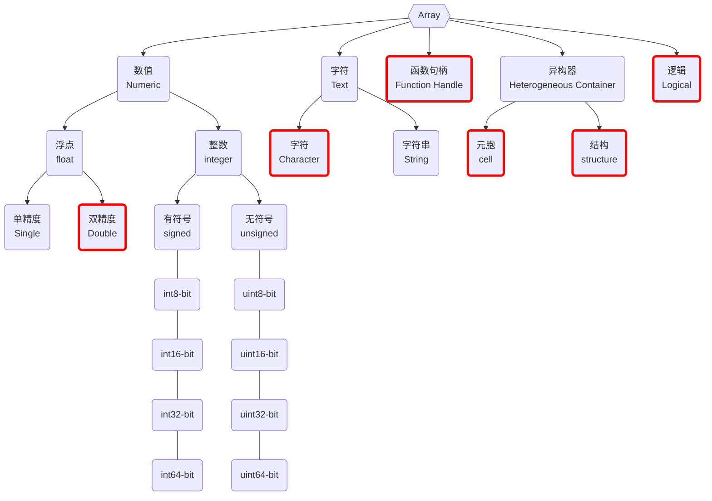

# Matlab Types

- MATLAB 中所有数据以 **[[Matlab Array|数组 array]]** 结构储存和调用, 数据类型指的是数组中**元素**的数据类型
- MATLAB 中的 Data Types 称为 Classes with Attributes
  - 如复数的 class 为 **double**, attributes 为 **complex**
  - 类比 [[Python]] 中的 [[Python Sequence]], 可以进行索引等操作
- 共有 \[15]"R2012b"+x 种内置基本数据类型, 和 2 种用户自定义类型

- 字符串类型 string 为新版本引入, 与字符类型 character 的区别大致可以字面理解, 详见 [[Matlab Characters and Strings]]
  - character 相当于数值类型中的数值, 每个字符严格为 2 bytes
  - 而 string 相当于数值数组看作一个整体
- 整数类型分为有符号 signed 和无符号 unsigned 两种, 即前者包含负数, 而后者不包含
- 整数类型后面的数字表示其 (二进制表示) 占用 bits
  - 同样的 x-bit 整数 unsigned 范围比 signed 范围大, 因为符号占用一个 bit

## Fundamental Data Types

- [[Matlab Array]]
  - [[Matlab Types - Numeric|Numeric]]
  - [[Matlab Types - Character|Character]]
  - [[Matlab Types - Structure|Structure]]
  - [[Matlab Types - Cell|Cell]]
  - [[Matlab Types - Logical|Logical]]
  - [[Matlab Types - Function Handle|Function Handle]]

## Determine Types

- 函数 [[Matlab Functions - class]]

## Types Conversion

[[!todo#A]]
