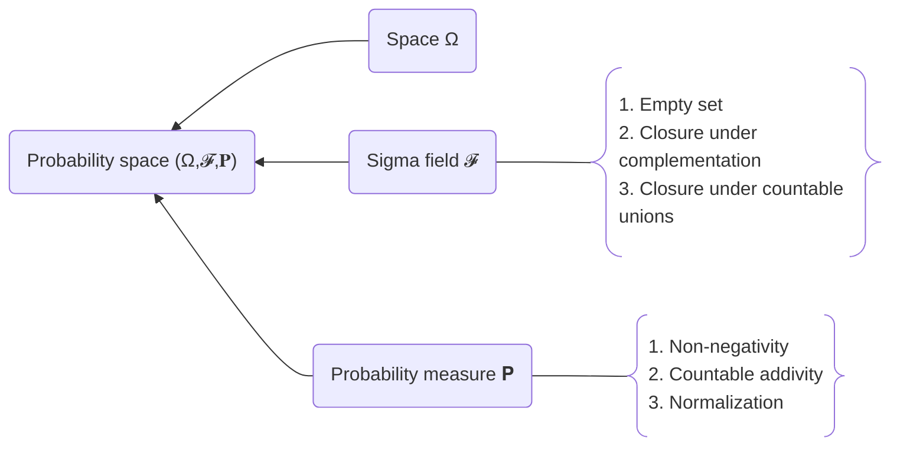

# Probability

Probability is a **mathematical language** that describes the unobserved world, using vocabulary from [[Measure|Measure Theory]].

The three defining conditions of a probability measure are also called the ==probability axioms==.

## Basic Concepts

- [[Probability Space]]
  - [[Sigma Field]]
  - [[Measure]]
    - [[Caratheodory's Extension]]
- [[Independence]]
- [[Conditional Probability]]
  - [[Law of Total Variance]]
  - [[Bayes' theorem]]
- [[Random Variable]]
  - [[Cumulative Distribution Function|CDF]], [[Probability Mass Function|PMF]], [[Probability Density Function|PDF]]
  - [[Expectation|Mean]], [[Variance]], [[Moment]]
  - [[Moment Generating Function|MGF]], [[Characteristic Function|CF]], [[Probability Generating Function|PGF]]
- Multiple Random Variables
  - [[Joint Distribution]]
  - [[Covariance]]
    - [[Cauchy-Schwarz Inequality]]
- [[Convergence of Random Variables]]
  - [[Law of Large Numbers]]
  - [[Central Limit Theorem]]
  - [[Chernoff Bound]]

## Advanced Notes

- [[Borel-Cantelli Lemma]]
- [[Chebyshev Inequality|Probability Inequalities]]
- [[Order Statistics]]
- [[Abstract Integration]]
  - [[Fatou's Lemma]]
  - [[Fubini's Theorem]]
- [[Extreme Value Theory]]

## Problems

- [[Pairwise Independence Is Not Mutual Independence]]
- [[Covariance and Independence]]
- [[A Counting Problem]]
- [[A Plausible Treatment Test]]
- [[Matching Problem]]

## Common Distributions

| Distribution                          | Notation                                                | Parameters                                                  | CDF                                                        | PMF/PDF                                                    | Mean                                                        | Variance                                                   | MGF                                                     | CF                                                     |
| ------------------------------------- | ------------------------------------------------------- | ----------------------------------------------------------- | ---------------------------------------------------------- | ---------------------------------------------------------- | ----------------------------------------------------------- | ---------------------------------------------------------- | ------------------------------------------------------- | ------------------------------------------------------ |
| [[Uniform Distribution]]              | ![[Uniform Distribution#^nota\|inline n-link naked]]    | ![[Uniform Distribution#^para\|inline naked n-link]]        | ![[Uniform Distribution#^cdf\|inline n-link naked]]        | ![[Uniform Distribution#^pdf\|inline naked n-link]]        | ![[Uniform Distribution#^mean\|naked inline n-link]]        | ![[Uniform Distribution#^var\|inline naked n-link]]        | ![[Uniform Distribution#^mgf\|inline naked n-link]]     |                                                        |
| [[Bernoulli Distribution]]            | /                                                       | ![[Bernoulli Distribution#^para\|inline naked n-link]]      | ![[Bernoulli Distribution#^cdf\|inline n-link naked]]      | ![[Bernoulli Distribution#^pdf\|inline naked n-link]]      | ![[Bernoulli Distribution#^mean\|naked inline n-link]]      | ![[Bernoulli Distribution#^var\|inline naked n-link]]      | ![[Bernoulli Distribution#^mgf\|inline naked n-link]]   |                                                        |
| [[Binomial Distribution]]             | ![[Binomial Distribution#^nota\|inline n-link naked]]   | ![[Binomial Distribution#^para\|inline naked n-link]]       | /                                                          | ![[Binomial Distribution#^pdf\|inline naked n-link]]       | ![[Binomial Distribution#^mean\|naked inline n-link]]       | ![[Binomial Distribution#^var\|inline naked n-link]]       | ![[Binomial Distribution#^mgf\|inline naked n-link]]    |                                                        |
| [[Poisson Distribution]]              | /                                                       | ![[Poisson Distribution#^para\|inline naked n-link]]        | /                                                          | ![[Poisson Distribution#^pdf\|inline naked n-link]]        | ![[Poisson Distribution#^mean\|naked inline n-link]]        | ![[Poisson Distribution#^var\|inline naked n-link]]        | ![[Poisson Distribution#^mgf\|inline naked n-link]]     | ![[Poisson Distribution#^cf\|inline naked n-link]]     |
| [[Exponential Distribution]]          | /                                                       | ![[Exponential Distribution#^para\|inline naked n-link]]    | ![[Exponential Distribution#^cdf\|n-link inline naked]]    | ![[Exponential Distribution#^pdf\|inline naked n-link]]    | ![[Exponential Distribution#^mean\|naked inline n-link]]    | ![[Exponential Distribution#^var\|inline naked n-link]]    | ![[exponential distribution#^mgf\|inline naked n-link]] | ![[exponential distribution#^cf\|inline naked n-link]] |
| [[Normal Distribution]]               | ![[Normal Distribution#^nota\|inline n-link naked]]     | ![[Normal Distribution#^para\|inline naked n-link]]         | /                                                          | ![[Normal Distribution#^pdf\|inline naked n-link]]         | ![[Normal Distribution#^mean\|naked inline n-link]]         | ![[Normal Distribution#^var\|inline naked n-link]]         | ![[Normal Distribution#^mgf\|inline naked n-link]]      | ![[normal distribution#^cf\|inline naked n-link]]      |
| [[Gamma Distribution]]                | /                                                       | ![[Gamma Distribution#^para\|inline naked n-link]]          | /                                                          | ![[Gamma Distribution#^pdf\|inline naked n-link]]          | ![[Gamma Distribution#^mean\|naked inline n-link]]          | ![[Gamma Distribution#^var\|inline naked n-link]]          | ![[Gamma Distribution#^mgf\|inline naked n-link]]       |                                                        |
| [[Beta Distribution]]                 | /                                                       | ![[Beta Distribution#^para\|inline naked n-link]]           | /                                                          | ![[Beta Distribution#^pdf\|inline naked n-link]]           | ![[Beta Distribution#^mean\|naked inline n-link]]           | ![[Beta Distribution#^var\|inline naked n-link]]           | ![[Beta Distribution#^mgf\|inline naked n-link]]        |                                                        |
| [[Dirichlet Distribution]]            | /                                                       | ![[Dirichlet Distribution#^para\|inline naked n-link]]      | /                                                          | ![[Dirichlet Distribution#^pdf\|inline naked n-link]]      | ![[Dirichlet Distribution#^mean\|naked inline n-link]]      | ![[Dirichlet Distribution#^var\|inline naked n-link]]      |                                                         |                                                        |
| [[Chi-Square Distribution]]           | ![[Chi-Square Distribution#^nota\|inline n-link naked]] | ![[Chi-Square Distribution#^para\|inline naked n-link]]     | /                                                          | ![[Chi-Square Distribution#^pdf\|inline naked n-link]]     | ![[Chi-Square Distribution#^mean\|naked inline n-link]]     | ![[Chi-Square Distribution#^var\|inline naked n-link]]     | ![[Chi-Square Distribution#^mgf\|inline naked n-link]]  |                                                        |
| [[Wishart Distribution]]              |                                                         |                                                             |                                                            |                                                            |                                                             |                                                            |                                                         |                                                        |
| [[t Distribution]]                    | /                                                       | ![[t Distribution#^para\|inline naked n-link]]              | /                                                          | ![[t Distribution#^pdf\|inline naked n-link]]              | ![[t Distribution#^mean\|naked inline n-link]]              | ![[t Distribution#^var\|inline naked n-link]]              | ![[t Distribution#^mgf\|inline naked n-link]]           |                                                        |
| [[F Distribution]]                    | /                                                       | ![[F Distribution#^para\|inline naked n-link]]              | /                                                          | /                                                          | ![[F Distribution#^mean\|naked inline n-link]]              | ![[F Distribution#^var\|inline naked n-link]]              | ![[F Distribution#^mgf\|inline naked n-link]]           |                                                        |
| [[Geometric Distribution]]            | /                                                       | ![[Geometric Distribution#^para\|inline naked n-link]]      | ![[Geometric Distribution#^cdf\|inline naked n-link]]      | ![[Geometric Distribution#^pdf\|inline naked n-link]]      | ![[Geometric Distribution#^mean\|naked inline n-link]]      | ![[Geometric Distribution#^var\|inline naked n-link]]      | ![[Geometric Distribution#^mgf\|inline naked n-link]]   |                                                        |
| [[Hypergeometric Distribution]]       | /                                                       | ![[Hypergeometric Distribution#^para\|inline naked n-link]] | /                                                          | ![[Hypergeometric Distribution#^pdf\|inline naked n-link]] | ![[Hypergeometric Distribution#^mean\|naked inline n-link]] | ![[Hypergeometric Distribution#^var\|inline naked n-link]] | /                                                       |                                                        |
| [[Cauchy Distribution]]               | /                                                       | ![[Cauchy Distribution#^para\|inline naked n-link]]         | ![[Cauchy Distribution#^cdf\|inline naked n-link]]         | ![[Cauchy Distribution#^pdf\|inline naked n-link]]         | ![[Cauchy Distribution#^mean\|naked inline n-link]]         | ![[Cauchy Distribution#^var\|inline naked n-link]]         | ![[Cauchy Distribution#^mgf\|inline naked n-link]]      |                                                        |
| Discrete [[Power Law Distribution]]   | /                                                       | ![[Power Law Distribution#^para\|inline naked n-link]]      | ![[Power Law Distribution#^cdf\|inline naked n-link]]      | ![[Power Law Distribution#^pdf\|inline naked n-link]]      | ![[Power Law Distribution#^mean\|naked inline n-link]]      | ![[Power Law Distribution#^var\|inline naked n-link]]      | ![[Power Law Distribution#^mgf\|inline naked n-link]]   |                                                        |
| Continuous [[Power Law Distribution]] | /                                                       | ![[Power Law Distribution#^para-cont\|inline naked n-link]] | ![[Power Law Distribution#^cdf-cont\|inline naked n-link]] | ![[Power Law Distribution#^pdf-cont\|inline naked n-link]] | ![[Power Law Distribution#^mean-cont\|naked inline n-link]] | ![[Power Law Distribution#^var-cont\|inline naked n-link]] | /                                                       |                                                        |
| [[Dirac Distribution]]                | ![[Dirac Distribution#^nota\|inline naked n-link]]      | ![[Dirac Distribution#^para\|inline naked n-link]]          | ![[Dirac Distribution#^cdf\|inline n-link naked]]          | ![[Dirac Distribution#^pdf\|inline naked n-link n-l2 ]]    | ![[Dirac Distribution#^mean\|naked inline n-link]]          | ![[Dirac Distribution#^var\|inline naked n-link]]          | ![[Dirac Distribution#^mgf\|inline naked n-link]]       |                                                        |
| [[Laplace Distribution]]              |                                                         |                                                             |                                                            |                                                            |                                                             |                                                            |                                                         |                                                        |

## References

- Textbooks
  - Dimitri P. Bertsekas and John N. Tsitsiklis, _Introduction to Probability_
  - Geoffrey Grimmett and David Stirzaker, _Probability and Random Processes_
  - Sheldon Ross, _Introduction to Probability and Statistics for Engineers and Scientists_
  - Gangjian Ying and Ping He, _Probability Theory_
- Courses
  - MIT 6.7700 w/ Prof. Philippe Rigollet, and 6.431 w/ Prof. John Tsitsiklis
  - Columbia STAT 5701, 5703
  - Fudan MATH 130009 w/ Prof. Gangjian Ying
