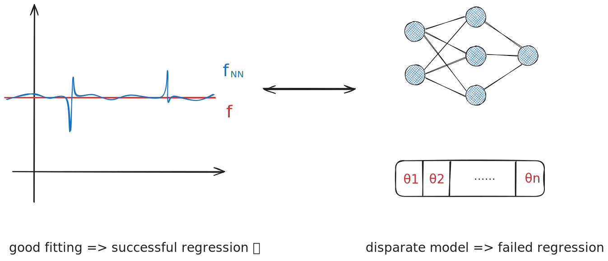

---
{"publish":true,"title":"Regression","created":"2023-01-19T14:53:16","modified":"2025-08-07T13:00:36","tags":["pub-stat"],"cssclasses":"","aliases":null,"type":"note","sup":["[[Machine Learning]]","[[Statistics]]"],"state":"[[%wip]]","related":["[[Prediction]]"]}
---


# Regression

> [!tldr]+ Everything is just linear regression
>
> ```mermaid
> graph LR
> AA(Linear Regression) --> A
> A(Least Squares) <--"Gaussian Linear Model"--> B(Maximum Likelihood Estimation)
> AA --"feature augmentation"--> G:::hidden
> G --"polynomial feature"--> C(Polynomial Regression)
> G --"general feature"--> D(Generalized Linear Regression)
> D --> S(Splines)
> A --"regularization"--> R:::hidden
> R --"L2"--> RR(Ridge Regression)
> R --"L1"--> L(LASSO)
> RR <--"Gaussian prior"--> M(Maximum a Posteriori)
> AA --"underdetermined system"--> N(Least Norm)
> N --"kernel"--> NK(Kernel Regression)
> AA --"prior to posterior"--> BB(Bayesian Linear Regression)
> BB --"kernel"--> BK(Gaussian Process Regression)
> B --"link function"--> GL(Generalized Linear Model)
> GL --> GLL(Logistic Regression)
> GL --> GLP(Poison Regression)
> GLL --"prior to posterior"--> BL(Bayesian Logistic Regression)
> 
> classDef hidden display: none;
> class A,AA,B,BB,BL,BK,C,D,G,GL,GLL,GLP,L,M,N,NK,R,RR,S internal-link
> ```

Regression is a fundamental statistical task[^1] aimed at uncovering the *relationship* between two correlated random variables. When one variable is designated as the _input_ and the other as the _output_, regression focuses on modeling the _effect_ of the input on the output. This setup makes regression closely related to, or often regarded as a type of, [[Prediction]] task, where the goal is to match the prediction to the true output; please refer to [[Regression#Regression and Prediction]] for more discussion on the relationship between the two tasks.

[^1]: Regression is also referred to as a class of methods that are used to solve this type of task.

A regression task involves the following components:

- Input variable $X$, whose samples are known as measurements, covariates, features, explanatory variables, and independent variables;
- Output variable $Y$, whose samples are known as responses, labels, and dependent variables;
- Model function $f$ that captures the relationship between the input and output.

The most general model is the conditional distribution $f(X) = P(Y\given X)$. More practically, we often do ==partial modeling==, which decomposes the model into a ==regression function== that *partially* describes the distribution of $Y$ and a residual uncertainty term.
The most common example takes the form
$$Y = f(X) + \epsilon,$$
where $\epsilon$ denotes a noise term and our goal is to recover the deterministic function $f$.
Our target random variable can also be various [[Statistic]]s of $Y$, such as conditional quantiles.
Moreover, a regression task often restricts the search space of $f$ to a [[Statistical Model\|parametric model]] $\{ f_{\theta} \}_{\theta\in\Theta}$. Different parametric models learn from data differently. The learned model $f_{\theta}$ is then called a regression function parameterized by $\theta$.

In the context of machine learning, regression is a [[Supervised Learning]] task, as the label is given for each sample.

Different regression function families and different loss functions give different regression models:

- [[Linear Regression]]
    - [[Linear Regression#Ordinary Least Squares]]
        - [[Gaussian Linear Model]]
    - Generalized Linear Regression
        - [[Linear Regression#Polynomial Regression]]
        - [[Splines]]
    - [[Underdetermined Linear System\|Least Norm]]
    - [[Ridge Regression]] `<->` [[L2 Regularization]]
    - [[LASSO]] `<->` [[L1 Regularization]]
    - [[Maximum a Posteriori]]
    - [[Bayesian Linear Regression]]
- [[Generalized Linear Model]]
    - [[Logistic Regression]]
    - [[Bayesian Logistic Regression]]
    - [[Poisson Regression]]
- Kernel Regression
    - [[Gaussian Process Regression]]

## Regression and Prediction

One could consider **regression and [[Prediction]] as distinct tasks** as they have different goals and thus different metrics. Given a random variable $(X,Y=f(X))$, regression focuses on fitting the model $f$, so it is evaluated using a model-level metric of the form $L(\hat{f},f)$. For example, if $f$ belongs to a parametric family $\{ f_{\theta } \}$, then the metric is usually of the form $L(\hat{f},f) = L'(\theta,\theta )$, reducing the task to an instance of [[Estimation]]. In contrast, prediction focuses on matching the output $f(X)$, typically evaluated via a pointwise metric of the form $L(\hat{f}(X),f(X))$, e.g., the zero-one prediction error.

One could also argue that **regression is a special case of [[Prediction]] task**, as the model $f$ is completely determined by the mapping $X \mapsto f(X)$, hence knowing the prediction $f(X)$ for *all* $X$ essentially recovers the model $f$.
However, the premise is almost never true and thus this inclusion is only theoretically valid. This is because in [[Statistics]] or [[Supervised Learning]], we only have access to the sample or training data, and thus the best predictor we can learn may deviate from the true model arbitrarily on the unseen data, even if their prediction on the unseen data is *close with high probability* (generalize well in terms of prediction error).
For example, even when the true model $f$ is simple, an over-parametrized neural network may learn a complex and uninterpretable predictor $f_{\mathrm{NN}}$ that achieves excellent prediction accuracy but bears little resemblance to $f$.
On the other hand, if we restrict our search space of the predictor to the class of regression models, then solving a prediction task essentially reduces to solving a regression task.
In other words, although we can view regression as a type of prediction task, not every prediction method is suitable for regression.
The converse is always true: regression, as a class of methods, can be used to solve prediction tasks.

One could also view **[[Prediction]] as a general regression task**, if we use the prediction accuracy as the fitting metric between the predictor and the model.
For example, we can have $f_{\mathrm{NN}}\overset{ P }{ \to }f$ as the sample size $n$ increases, in terms of that $\lim_{ n \to \infty }P(|f_{\mathrm{NN}}(X)-f(X)|>\epsilon)=0$. In this sense, we can say $f_{\mathrm{NN}}$ fits $f$ well and solves the regression task under a prediction-oriented metric.

Ultimately, different aspects view the relationship between regression and prediction differently, with the distinction lying in the **specific goals and metrics**.


