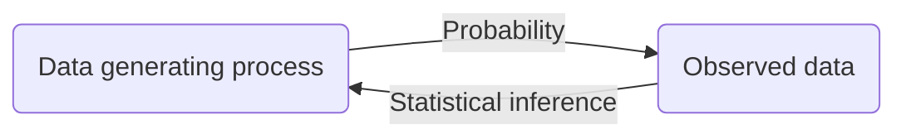

---
{"publish":true,"title":"*Sufficient* of Statistics","created":"2023-10-17T21:41:50","modified":"2025-08-25T19:56:53","tags":["pub-stat"],"cssclasses":"","type":"index","sup":["[[Math]]"],"state":"done","banner":"https://raw.githubusercontent.com/zcysxy/Figurebed/master/img/20231017221426.png","pub-banner":"https://raw.githubusercontent.com/zcysxy/Figurebed/master/img/stat-icon.svg","banner_icon":"🔮","reference":"AOS"}
---

# Statistics

Statistics is a **problem-solving procedure**:

## Map of Contents

### Basic Concepts

- Setup
    - [[Statistical Model]]
    - [[Statistical Decision Theory]]
    - [[Risk]]
    - [[f-Divergence]]
        - [[Total Variation Distance]]
        - [[KL Divergence]]
- [[Estimation]]
    - Point Estimation
        - [[Evaluating an Estimator]]
        - [[Maximum Likelihood Estimation]]
        - [[Method of Moments]]
        - [[Mean Squared Error]]
        - [[M-Estimator]]
        - [[Z-Estimator]]
    - Interval Estimation: [[Confidence Interval]]
    - Distributional Estimation: [[Bayesian Inference]]
- [[Hypothesis Testing]]
    - [[Evaluating a Test]]
        - [[Bayes Optimal Test]]
        - [[Uniformly Most Powerful Test]]
    - [[p-value]]
- [[Regression]]
    - [[Linear Regression#Ordinary Least Squares]]
        - [[Gaussian Linear Model]]
    - Regularized Linear Regression
        - [[Ridge Regression]]
        - [[LASSO]]
    - [[Generalized Linear Model]]
        - [[Logistic Regression]]
        - [[Poisson Regression]]
- [[Prediction]]
    - [[Probably Approximately Correct]]
    - [[Conformal Prediction]]
    - [[Risk-Control Prediction]]

### Advanced Topics

- Advanced concepts
    - [[Sufficient Statistic]]
    - [[Statistical Functional]]
    - [[Admissibility]]
- [[Inference for CDFs]]
- [[Expectation Maximization]]
- More on hypothesis testing
    - [[Likelihood Ratio Test]]
    - [[Uniformly Most Powerful Test]]
    - [[Bayes Optimal Test]]
    - [[Multiple Hypothesis Testing]]
    - [[Goodness of Fit Test]]
    - [[Permutation Test]]
    - [[ANOVA]]
- More on regression: see the list in [[Regression]].
- Hypothesis testing and other statistical procedures
    - [[Confidence Interval and Hypothesis Test Duality]]
    - [[Hardness of Simple Hypothesis Test Through Total Variation]]
    - [[Hardness of Estimation Through Testing]]
    - [[Testing for Regression]]

### Interactive Notebooks

- [[Tail Bounds and Concentration Inequalities]]
- [[Constructing Confidence Interval]]
- [[Best Estimator for Uniform Distribution Parameter]]

## Statistics and Machine Learning

| Statistics                          | **[[Machine Learning]]**            |
| ----------------------------------- | ----------------------------------- |
| [[Estimation]]                      | [[Machine Learning\|learning]]      |
| [[Confidence Interval\|confidence]] | uncertainty                         |
| [[Regression]]                      | [[Supervised Learning]]             |
| [[Clustering]]                      | [[Unsupervised Learning]]           |
| [[Hypothesis Testing\|hypothesis]]  | [[Classification]]                  |
| covariates                          | features                            |
| coefficient                         | weight                              |
| predictor                           | input                               |
| response                            | output                              |
| intercept                           | bias                                |
| derived predictor                   | [[Hidden Units]]                    |
| penalty function                    | [[L2 Regularization\|weight decay]] |

## Probability and Statistics

[[Probability]] answers the following question:

> [!qn] Given a data generating process, what are the properties of the outcomes?

While statistical inference answers the inverse problem:

> [!qn] Given the outcomes, what can we say about the process that generated the data?

## References

- Textbooks
    - Larry Wasserman, *All of Statistics*
    - van der Vaart, *Asymptotic Statistics*
    - Sheldon Ross, *Introduction to Probability and Statistics for Engineers and Scientists*
- Courses
    - MIT 6.S951 w/ Prof. Stephen Bates, 18.6501 w/ Prof. Philippe Rigollet
    - Columbia STAT 5701, 5703
