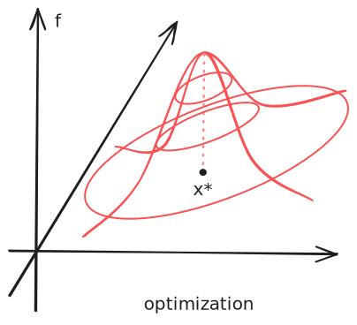
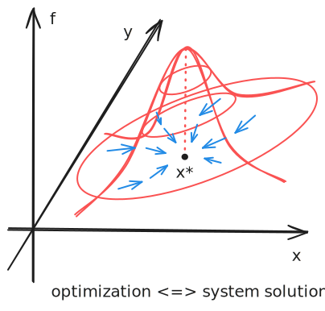

---
{"publish":true,"title":"Z-Estimator","created":"2025-06-06T16:34:37","modified":"2025-06-11T19:23:01","cssclasses":"","state":"done","sup":["[[Estimation]]"],"alias":null,"type":"note"}
---

# Z-Estimator

Recall that an [[M-Estimator]] seeks the minimizer of a function $M_{n}$. Suppose the function is differentiable and convex, its minimizer equals the **zero** of its derivative
$$
\Psi _{n}(\hat{\theta}) = \frac{1}{n} \sum_{i=1}^{n}\psi _{\hat{\theta}}(X_{i}) = 0, \tag{Z}
$$
where in this case, $\psi$ is the derivative of $m$ in the definition of M-estimator.
For example, [[Maximum Likelihood Estimation\|MLE]] is an estimator w.r.t the [[Likelihood#Score Function]] $\psi _{\theta} = \frac{ \partial  }{ \partial \theta }\log p_{\theta }(X)$.

However, $\psi$ can be more general without necessarily corresponding to an optimization problem. For example, recall that for a [[Method of Moments\|Moment Estimator]], we solve a system
$$
\frac{1}{n}\sum_{i=1}^{n}\psi _{\hat{\theta}}(X_{i})= \frac{1}{n} \sum_{i=1}^{n}\left(  \mathbb{E}_{\hat{\theta}}g - g(X_{i}) \right) = \mathbb{E}_{\hat{\theta}}g - \hat{\mathbb{E}}_{n}g = 0.
$$
Thus, [[Method of Moments\|Moment Estimator]]s are also a special case of Z-estimators.

As we can see, Z-estimators are a class of more general estimators that solve the zero point of a system of ==estimating equations== $(Z)$.

- [c] Table. Comparison of optimization and system solution.

| Optimization                                     | System Solution                            |
| ------------------------------------------------ | ------------------------------------------ |
| M-estimators                                     | Z-estimators                               |
| Optimizing an objective function                 | Solving an equation system                 |
| Utilize optimization landscape, e.g., gradient   | Utilize system dynamics, e.g., contraction |
|  |  |

As we discussed earlier, for convex/concave and differentiable objective functions, optimization is equivalent to solving a system regarding the gradient.
Conversely, we can also define an objective function for solving a system of equations. For example, for a linear system $Ax=b$, we can define the squared cost $f(x) = \|Ax-b\|_{2}^{2}$, whose minimizer is the solution of the system.

However, different problem formulations offer different insights and solution methods.

- Optimization is more suitable if you have a clear and well-motivated objective function;
- System solution is more suitable when you know how the solution determines the system dynamics.
- When optimizing a function, we usually care more about how the local landscape, e.g., gradient, carries the decision variable to the optimum;
- When solving a system, we usually want to follow some system dynamics, e.g., a contractive operator, to reach the solution.

## Properties

### Asymptotic Normality

Let $\theta ^*$ solve the system $\mathbb{E}[\psi_{\theta ^*}(X)]=0$. Suppose the consistency holds: $\hat{\theta}\overset{ P }{ \to }\theta ^*$.
Then, under some regularity conditions:

- $\theta \mapsto \psi _{\theta}(x)$ is twice differentiable for all $\theta$ and $\|\ddot{\psi}_{\theta}(x)\| \le f(x)$ for some integrable function $f$;[^1]
    - or, there exists an $L_{2}$ function $g$ such that for any $\theta_{1},\theta_{2}$ in a neighborhood of $\theta ^*$, we have $\|\psi _{\theta_{1}}(x)-\psi _{\theta_{2}}(x)\| \le g(x)\|\theta_{1}-\theta_{2}\|$;
- $\mathbb{E} \dot{\psi}_{\theta}(X)$ exists and is non-singular in a neighborhood of $\theta ^*$;
- $\mathbb{E} \psi _{\theta ^*}\psi _{\theta ^*}^T$ exists;

we have
$$
\sqrt{ n }\left( \hat{\theta}-\theta ^* \right) \overset{ d }{ \to } \mathcal{N}(0,V_{\theta ^*}^{-1}\mathbb{E}[\psi _{\theta ^*}\psi _{\theta ^*}^T]V_{\theta ^*}^{-1}),
$$
where $V_{\theta ^*} = \frac{ \partial  }{ \partial \theta }\mathbb{E} \psi _{\theta}(X)|_{\theta ^*}$.

[^1]: The measure is always the probabilistic measure.

#### Relation to Asymptotic Normality of M-Estimators

If $\psi _{\theta} = \dot{m}_{\theta}$, where $m$ is the objective function for an [[M-Estimator]], we can see that the asymptotic normality of Z-estimators implies the asymptotic normality of M-estimators.

However, the regularity conditions for Z-estimators are stronger than those for M-estimators (see [[M-Estimator#Asymptotic Normality]]). For example, we can show that [[M-Estimator#Asymptotic Normality of Quantile Regression\|quantile regression satisfies the asymptotic normality conditions for M-estimators]]; but it does not satisfy the conditions for Z-estimators.

#### Proof Sketch

Denote $\Psi(\theta)\coloneqq \mathbb{E}\psi _{\theta}(X)$; recall that $\Psi _{n}(\theta)\coloneqq \hat{\mathbb{E}}_{n}\psi _{\theta}(X)$. By Taylor expansion,
$$
0 = \Psi _{n}(\hat{\theta}) = \Psi _{n}(\theta ^*) + \dot{\Psi}_{n}(\theta ^*)(\hat{\theta}-\theta ^*) + o_{P}(\|\hat{\theta}-\theta ^*\|).
$$
Since we assume the consistency, we get
$$
\sqrt{ n }(\hat{\theta} - \theta ^*) \overset{ P }{ \to } -\dot{\Psi}_{n}(\theta ^*)^{-1}(\sqrt{ n }\Psi _{n}(\theta ^*)).
$$
By [[Law of Large Numbers\|LLN]], $\dot{\psi}_n(\theta ^*)^{-1}\to \dot{\psi}(\theta ^*)^{-1}$; by [[Central Limit Theorem\|CLT]],
$$
\sqrt{ n  }\Psi _{n}(\theta ^*) \overset{ d }{ \to } \mathcal{N}(0,\mathbb{E}[\psi _{\theta ^*}\psi _{\theta ^*}^T]).
$$
Thus, by Slutsky's theorem,
$$
\sqrt{ n }(\hat{\theta}-\theta ^*) \overset{ d }{ \to } \mathcal{N}l(0,\dot{\Psi}(\theta ^*)^{-1}\mathbb{E}[\psi _{\theta ^*}\psi _{\theta ^*}^T]\dot{\Psi}(\theta ^*)^{-1}).
$$

#### Asymptotic Normality of Least Squares

We cast [[Ordinary Least Squares]] as a Z-estimator and verify the asymptotic normality conditions. The cost function is $m_{\theta}(x,y) = (y-\theta ^Tx)^{2}$, which gives the z-function $\psi _{\theta}(x,y) = 2x(y-x^T\theta )$.

For the first condition, we verify its alternative Lipschitz condition:
$$
\|\psi _{\theta_{1}}(x,y)-\psi _{\theta_{2}}(x,y)\| \le 2\|xx^T\|\|\theta_{1}-\theta_{2}\|.
$$
Suppose $X$ has finite moments, then the first condition is met.

For the second condition, we have
$$
\mathbb{E} \dot{\psi}_{\theta}(X) = -2\mathbb{E}[XX^T].
$$

For the third condition, we have
$$
\mathbb{E} \psi _{\theta ^*}\psi _{\theta ^*}^T =  \mathbb{E}\left[ 4(Y-X^T\theta ^*)^{2} XX^T \right] .
$$

Therefore, by the asymptotic normality of Z-estimators, we have
$$
\sqrt{ n }(\hat{\theta}-\theta ^*)\overset{ d }{ \to } \mathcal{N}\left( 0, (\mathbb{E}XX^T)^{-1} \mathbb{E}\left[ (Y-X^T\theta ^*)^{2}XX^T \right] (\mathbb{E}XX^T)^{-1} \right) .
$$
